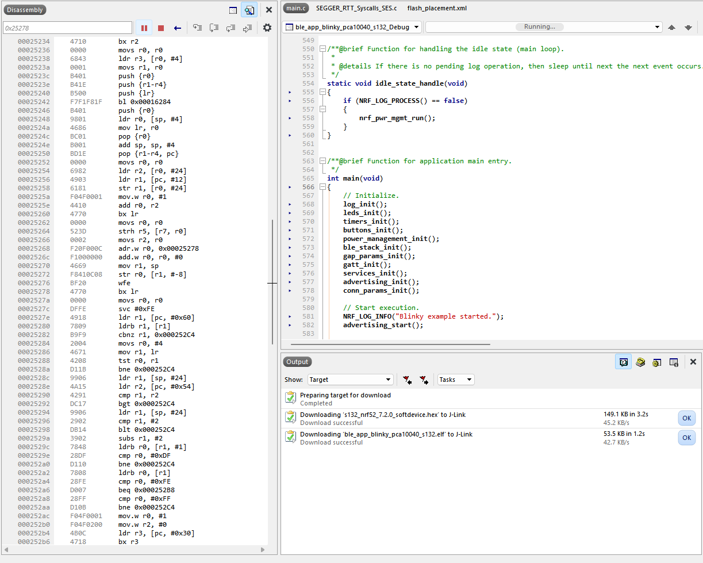

# nRF52 Getting Started Guide
This guide will assist you in getting started with development for the [nRF52 DK](https://www.nordicsemi.com/Products/Development-hardware/nRF52-DK/GetStarted?lang=en#infotabs). First, we will walk you through hardware and software requirements and how to install the necessary software. Then, we will walk through a couple of guides to get you comfortable with development.

# Step 1: Gather, Install, and Setup System Requirements
## Hardware
The following hardware will be required for developing with the nRF52 DK:
* Micro USB cable (for board power/connecting to computer)
* [nRF52 DK](https://www.nordicsemi.com/Products/Development-hardware/nRF52-DK/GetStarted?lang=en#infotabs)
* Computer (Windows 10 / Windows 11 were used in our demo)
* Smartphone (for Bluetooth scanning / testing purposes)

## Computer Software
### Warnings Before Installing Software
* Install each piece of software in the order listed below for ease of install. 
* For each piece of software, carefully read any notes prior to beginning install: they include important info, tips, and steps that may need to be skipped!
### Install Software
1. **nRF5 SDK (17.1.0** was used for our demo)
    * This includes SoftDevices for our dev board (S112, S132, S212, S312, and S332)
        * The SoftDevice is the wireless protocol stack
        * **S132 was used for our demo** - additional SoftDevices are optional
        * Note: The S212, S312, and S332 SoftDevices can only be downloaded from thisisant.com since they include the ANT+ protocol stack. If you wish to install these, the website will ask you to create a developer account to access the download, but you will not be charged for personal use
    * **Download link**: https://www.nordicsemi.com/Products/Development-software/nrf5-sdk
2. **nRF Command Line Tools (10.23.2** was used for our demo)
    * **Note**: This bundle includes an install for **Segger J-Link (version 7.88j** was used for our demo), which will also be required in your work
        * You may see a prompt that says "Do you want to update" with an empty list - that is fine, just carry on
    * **Download link**: https://www.nordicsemi.com/Products/Development-tools/nrf-command-line-tools/download#infotabs
    * **Install verification**: Once installed, verify the successful install with the following steps:
        * Open a fresh terminal window (or close and reopen an existing window)
        * Type "nrfjprog --version"
        * Press Enter
3. **nRF Connect for Desktop (4.3.0** was used for our demo)
    * **Note**: You may be prompted to re-install Segger J-Link during this install. Both versions should be 7.88j, but if the Connect for Desktop install prompts for a newer version, install this.
    * **Download link**: https://www.nordicsemi.com/Products/Development-tools/nRF-Connect-for-desktop
    * **After you have finished the install**, open Connect for Desktop and **install the following apps**:
        * **Bluetooth Low Energy** (latest - 4.0.4 patch1 was tested)
        * **Programmer** (latest - 4.1.0 was tested)
        * **Toolchain Manager** (latest - v1.2.6 was tested, saw an error attempting to install v1.3.0)
            * Allows you to manage the nRF5 SDK version(s)
4. **Segger Embedded Studio for ARM (7.10a** used for our demo)
    * **Note**: On Windows, the Windows install suffices, "Windows ARM" is not required
    * **Note**: On Linux, the Linux install suffices, "Linux ARM" is not required
    * **Download link**: https://www.segger.com/downloads/embedded-studio

## Mobile Apps
Some mobile apps are helpful for testing applications and running examples for the nRF52 DK. Download the following from your phone's app store (App Store on iOS, Google Play Store on Android):
* **nRF Toolbox**
    * Tool for simulating sensor data
* **nRF Connect**
    * Tool for Bluetooth scanning

# Step 2: Basic Connection Test
Once you've acquired the necessary hardware and downloaded/installed the necessary software, you are ready to begin testing the nRF52 DK. The Nordic Semiconductor website has a simple 6-step guide for testing out your board out of the box. We have validated this guide and have a few notes for you to keep in mind as you step through it:
* **Step 1**: The NFC antenna is not necessary for the example to run.
* **Step 5**: The "pulsing" is slow.
* **Step 6**: You have to press and release the buttons for the lights to change.

This 6-step guide can be found at the following link: https://www.nordicsemi.com/Products/Development-hardware/nRF52-DK/GetStarted?lang=en#infotabs 

# Step 3: Run a Precompiled Application
The nRF5 SDK you installed comes with several examples and templates to modify. Each example app comes with a precompiled application in the form of a hex file to assist you in sanity checking the development kit's functionality and your environment prior to making any changes. The following steps (abbreviated from section 5 of the [Nordic Getting Started Guide](https://infocenter.nordicsemi.com/pdf/getting_started_nRF5SDK_ses.pdf)) explain how to program and run one such precompiled application on your development kit.

1. Power up the development kit:
    1. Connect one end of a micro-USB 2.0 cable to the Universal Serial Bus (USB) connector on the kit and the other end to one of your PC's USB host ports.
    2. Slide the power switch to ON. Observe that LED1 starts blinking.
    
2. Open a file explorer and confirm that the development kit has appeared as a removable drive named JLINK.
    1. On Windows, you may see a pop-up window similar to this:
    
3. In the folder where you extracted the nRF5 SDK, navigate to examples\ble_peripheral\ble_app_hrs\hex
4. Select the **ble_app_hrs_pca10040_s132.hex** HEX file (this is a Bluetooth SoftDevice for the nRF52 DK) and copy it to the JLINK drive. The development kit will now restart and run the application. Note that while restarting, the JLINK drive will be disconnected.
    * If you run into issues drag-n-dropping a HEX file into your J-Link drive (e.g. the program does not seem to work and you have a FAIL file appear in your drive), you may need to program your device directly via Segger Embedded Studio
    * To do so for this example app, follow the steps below:
        * Click "Open Solution" in Segger Embedded Studio and select the "\PATH\TO\NRF52SDK\examples\ble_peripheral\ble_app_hrs\pca10040\s132\ses\ble_app_hrs_pca10040_s132.emProject" file
            * **Note**: we tried using the S332 SoftDevice and ran into problems, so we pivoted to the S132 SoftDevice
        * Select Build -> Build ble_app_hrs_pca10040_s132 (or press F7)
        * Observe the output in the output pane below. If the build fails, check the **Compilation Issues** section of the **Troubleshooting** section below for some tips. Otherwise, Google :)
        * Once you have built successfully, flash the built firmware to your board by selecting Target -> Download ble_app_hrs_pca10040_s132
5. Open nRF Toolbox.
    * Note: Enable Bluetooth if prompted.
6. Tap Heart Rate from the list of services
    * **Android** screenshot below:
    
7. Tap Connect to begin a Bluetooth scan.
8. Select Nordic_HRM to pair to your development kit:
    * **Android** screenshot below:
    
9. Observe a simulated heart rate and battery charge percentage is displayed.

# Step 4: Program an Application
The following steps (abbreviated from section 7 of the [Nordic Getting Started Guide](https://infocenter.nordicsemi.com/pdf/getting_started_nRF5SDK_ses.pdf)) explain how to program an application from the source code in Segger Embedded Studio (SES).

## Erasing the Kit
* While the nRF52 DK is connected to the computer via USB, open a terminal and enter "nrfjprog --family nRF52 --eraseall". The output should be: 
```
Erasing user available code and UICR flash areas.
Applying system reset.
```

## Compiling the Application
1. Click "Open Solution" in Segger Embedded Studio and select the "\PATH\TO\NRF52SDK\examples\ble_peripheral\\ble_app_blinky\pca10040\s132\ses\ble_app_blinky_pca10040_s132.emProject" file
    * **Note**: we tried using the S332 SoftDevice and ran into problems, so we pivoted to the S132 SoftDevice
    
2. Select Build -> Build ble_app_blinky_pca10040_s132 (or press F7)
3. Observe the output in the output pane below. If the build fails, check the **Compilation Issues** section of the **Troubleshooting** section below for some tips. You may need to run Build -> **Rebuild** ble_app_blinky_pca10040_s132 (Alt + F7) to properly build after modifying the project.
4. Once the build succeeds, switch the output pane to show "Tasks" instead of "Output" to observe the memory layout of the compiled application:
    * 

## Configuring the Placement of the SoftDevice
**Note**: If you are using a SEGGER Embedded Studio (SES) project from nRF5 SDK v14.2.0 or later, the placement of the SoftDevice is already configured correctly and you can skip this step.

We recommend using version 17.10a, so **you should be able to skip this step**, but if you do need to modify the SoftDevice placement, here is a helpful guide for selecting start addresses: https://devzone.nordicsemi.com/guides/short-range-guides/b/getting-started/posts/adjustment-of-ram-and-flash-memory.


1. Right-click on Project - select Options:
    * 
2. Click on Linker, then double-click on "Section Placement Macros". Add options for FLASH_START and SRAM_START (note - very basic examples like Hello don't include this since they don't use a SoftDevice)
    * 
3. Select ALT + F7 to rebuild - if the build outputs any recommended different values, use those
4. Select Options again, this time selecting the Preprocessor -> Preprocessor Definitions. Observe the values inherited by the example project:
    * 
    * NO_VTOR_CONFIG: Tells SES to expect a SoftDevice to be present, forwards exceptions and interrupts to application
    * NRF_SD_BLE_API_VERSION: based on the major number of your SoftDevice version (ex. for 7.2.0, the version number is 7)
5. Now, select Loader under Debug and ensure the SoftDevice path is properly configured
    * 
6. Select Alt + F7 to rebuild after your changes: ensure your output has no warnings

## Programming the Firmware
1. Select F5 (Debug -> Go) to program the application to your dev board (it should be plugged in), and then debugging will begin
    * 
    * Notice a call stack frame appears - you can select the Pause icon to pause execution and the disassembled code appears on the left hand side
    * 
    * And the Play icon resumes execution
    * 

## Communicating with the Kit: RTT
RTT is natively supported by SES, so it's a simple method of communicating with your development kit
1. Open J-Link RTT Viewer (installed with the nRF Command Line Tools - search your computer for the **J-Link RTT Viewer**)
2. Select the dev kit from the dropdown menu under "Specify Target Device"
    * 
3. Select "Ok", observe the terminal changes:
    * 

# Your Turn
Now that you've programmed the nRF52 DK with a basic application, try programming the provided generic_ble_profile_wip application. You should be able to copy + paste its contents into the contents of an example application (ble_peripheral/ble_app_template, for example).

This application results in the nRF52 DK advertising via BLE with the name GDuk. Using nRF Connect (Mobile), you can connect to the device and read, write, and register for notifications for its custom data field.

# Troubleshooting
## General issues
* Make sure the power switch on your board is set to "On" and the board is powered
* Double check you have installed all of the software on the list above and those installs succeeded
## Connection issues to the computer
* Try switching out your Micro USB cable - these commonly fail and cause problems connecting to the computer
* Try using a different port on your computer
* Miscellaneous other ideas:
    * https://devzone.nordicsemi.com/f/nordic-q-a/37895/nrf52-dk-does-not-show-as-a-removeable-drive-in-windows-file-explorer
    * https://infocenter.nordicsemi.com/index.jsp?topic=%2Fug_gsg_ses%2FUG%2Fgsg%2Fintro.html&cp=1_1_2 
    * https://devzone.nordicsemi.com/f/nordic-q-a/24592/my-nrf52-nrf51-dk-kit-doesn-t-work
## Compilation issues
* If you receive errors about "#include "__vfprintf.h" failing:
    * Remove SEGGER_RTT_Syscalls_SES.c from the project (refer to this solution: https://devzone.nordicsemi.com/f/nordic-q-a/85405/nrf5-sdk-17-1-0-examples-is-not-compiling-in-latest-ses-6-20a)
* If you receive errors about "error: .text is larger than specified size ses"…
    * Right click the Project file from the Project Explorer pane on the left hand side
    * Select "Edit Section Placement"
    * Find the ProgramSection with the name ".text" and remove the 'size="0x4"' portion:
        ```
        <ProgramSection alignment="4" load="Yes" name=".text" size="0x4" />
        ```
    * Find the ProgramSection with the name ".rodata" and remove the 'size="0x4"' portion:
        ```
        <ProgramSection alignment="4" load="Yes" name=".rodata" size="0x4" />
        ```
    * For reference: https://devzone.nordicsemi.com/f/nordic-q-a/89236/build-error